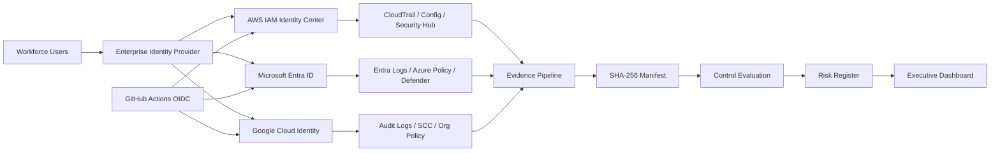

# Enterprise IAM Compliance Architecture

## Design Principles

- Federated workforce access
- Short-lived workload credentials
- Least privilege by default
- Automated evidence collection
- Policy-as-code enforcement
- Centralized control mapping
- Repeatable audit procedures
