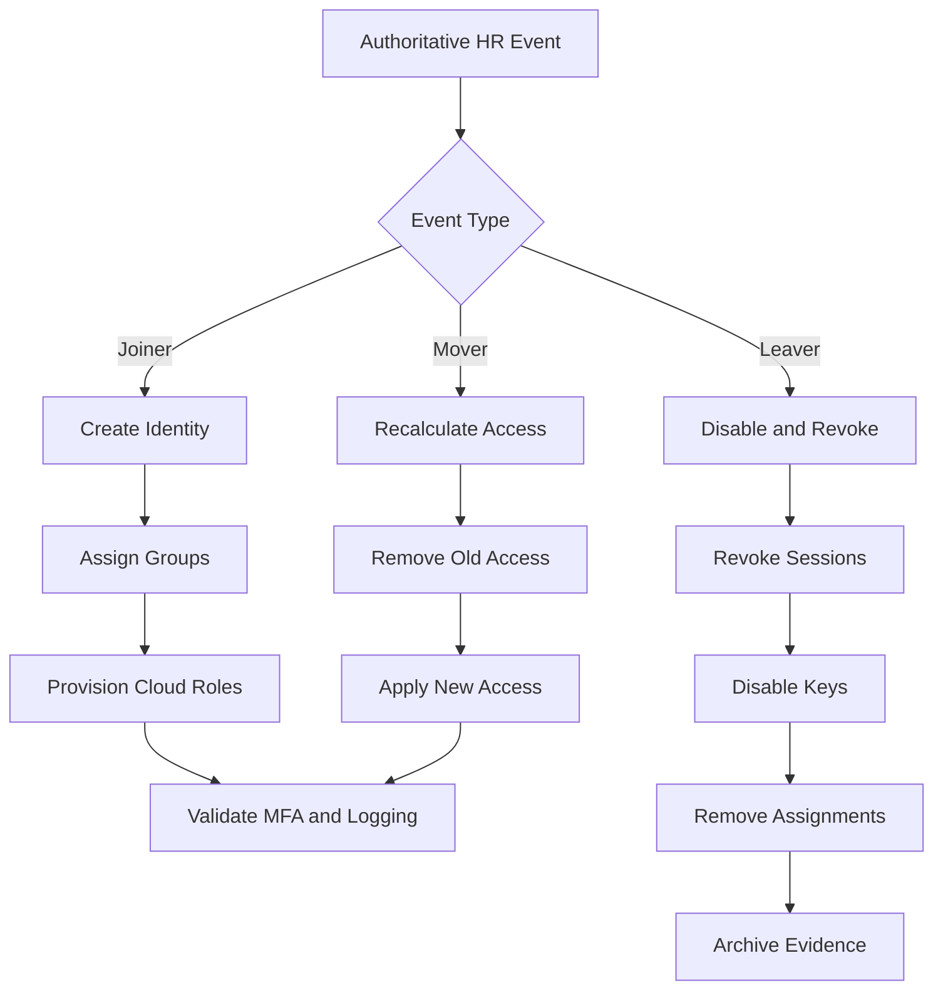

# Identity Lifecycle

```mermaid
flowchart TD
    HR[Authoritative HR Event] --> J{Event Type}
    J -->|Joiner| C[Create Identity]
    J -->|Mover| M[Recalculate Access]
    J -->|Leaver| D[Disable and Revoke]

    C --> G[Assign Groups]
    G --> R[Provision Cloud Roles]
    R --> V[Validate MFA and Logging]

    M --> A[Remove Old Access]
    A --> N[Apply New Access]
    N --> V

    D --> S[Revoke Sessions]
    S --> K[Disable Keys]
    K --> X[Remove Assignments]
    X --> E[Archive Evidence]
```
