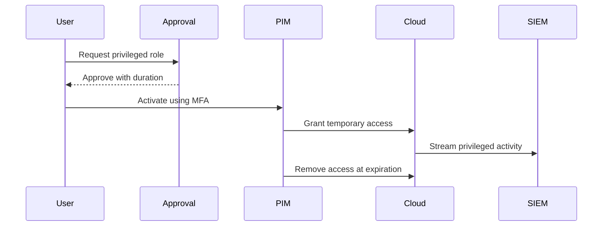

# Privileged Access Model

```mermaid
sequenceDiagram
    participant User
    participant Approval
    participant PIM
    participant Cloud
    participant SIEM

    User->>Approval: Request privileged role
    Approval-->>User: Approve with duration
    User->>PIM: Activate using MFA
    PIM->>Cloud: Grant temporary access
    Cloud->>SIEM: Stream privileged activity
    PIM->>Cloud: Remove access at expiration
```

Permanent standing administrator access is prohibited except for monitored emergency identities.
